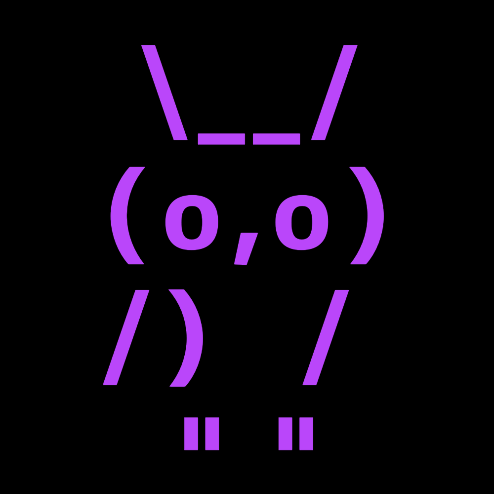

# Steganography Owl Example

This repository demonstrates image steganography by hiding text within image files. The primary example embeds the entire text of Oscar Wilde's "The Picture of Dorian Gray" within a purple owl image!

## What is Steganography?

Steganography is the practice of concealing information within other non-secret data or a physical object to avoid detection. In this case, we're hiding text data within the least significant bits of image pixel values.

## Features

- Embed text messages or entire text files within images
- Use all color channels (RGB) for maximum storage capacity
- Advanced data compression (zlib) to maximize storage efficiency
- CRC32 checksum verification to ensure data integrity
- Visualizations of where data is hidden in the image
- Command-line interface for easy use

## Example

The repository includes a demonstration that embeds the entire text of "The Picture of Dorian Gray" (456,947 bytes) into a simple purple owl image. The text is compressed to 172,551 bytes (37.76% of original size) before embedding.



## Usage

### Requirements

```
python3 -m pip install matplotlib opencv-python pillow numpy
```

### Embedding a Message

```bash
# Basic usage with a text file
python3 main.py -i owl.png -f the_picture_of_dorian_gray.txt -a -o output_folder

# Or with a direct message
python3 main.py -i owl.png -m "Your secret message here" -a -o output_folder
```

Options:
- `-i, --image`: Path to input image (optional, generates gradient if omitted)
- `-m, --message`: Text message to embed
- `-f, --file`: Path to text file containing message to embed
- `-a, --all-channels`: Use all color channels (RGB) for maximum capacity
- `-o, --output`: Output directory name

### Extracting a Message

```bash
python3 main.py -e -i output_folder/stego_message.png -a -o extract_folder
```

Options:
- `-e, --extract`: Extract mode
- `-i, --image`: Path to steganography image
- `-a, --all-channels`: Use all color channels (must match embedding)
- `-o, --output`: Output directory for extracted files

## How It Works

1. **Text Preparation**: The text is compressed using zlib to reduce size.
2. **Header Creation**: A header containing the payload length and CRC32 checksum is generated.
3. **Bit Embedding**: The compressed data and header are embedded in the 2 least significant bits of pixel values.
4. **Extraction**: When extracting, the process is reversed - bits are read, the header parsed, and data decompressed.

## Output Files

The program generates several files:
- `stego_message.png`: The image with embedded message
- `original.png`: The unmodified original image
- `difference.png`: Visualization of pixel changes
- `difference_heatmap.png`: Heat map showing data locations
- `magnified_comparison.png`: Side-by-side comparison of a zoomed area
- `info.txt`: Details about the steganography process
- `embedded_message.txt`: Copy of the embedded text

## Performance

With the owl image example (1000x1000 pixels):
- Storage capacity: 6,000,000 bits (750,000 bytes)
- The entire novel (456,947 bytes) uses only 45.17% of available capacity
- Compression ratio: 37.76% (62.24% space savings)
- Perfect extraction verified: 100% match with CRC32 validation

## License

MIT License 